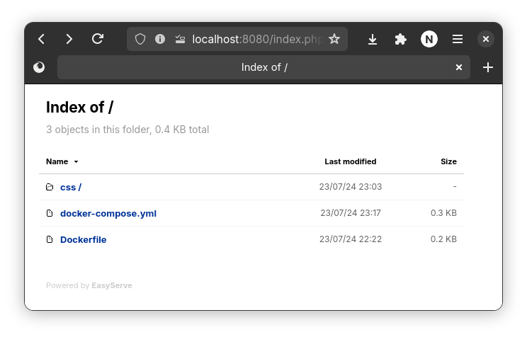

### 1. EasyServe:

A straightforward yet customizable Docker container designed for serving files over the internet, featuring support for a variety of color schemes.





View the source code on [github](https://github.com/knsrinath/easyserve).
